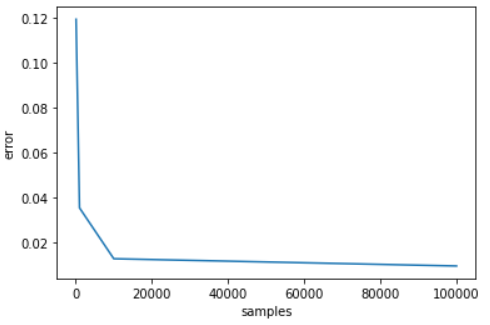

# kmeanbatches
Clustering vectors to speed up prediction

For a big face dataset, prediction consumes lots of time. Then, a possible solution is using K-means Clustering algorithm to assign faces into different groups and return centers of those. Therefore, the prediction can be faster by predicting new images within a specific cluster instead of whole dataset.

# Disadvantages:
Face dataset must be big enough for the best performance.

Error drops when there are more samples

